build-lists: true

## Cure What Ails You
### With This
# [fit] Rx
*an intro to the reactive extensions*

---

# Matt Soucoup

* Code Mill Technologies
* Xamarin MVP
* *_Blog:_* **codemilltech.com**
* *_Email:_* **msoucoup@codemilltech.com**
* *_Twitter:_* **@codemillmatt**

^ Talk a bit about how I got into Rx: *Develop Xamarin apps and need to handle lots of user input as well as server communication and IOT communication and that happens async - needed a better way to be alerted and a better way to handle as to when those happened

---

## We live in a push based world

* Tweets
* Taps & Touches
* Async I/O - DBs, REST services
* Web Sockets
* Device Services - GPS, BLE, etc

---

# [fit] We need a solid way to handle
# [fit] an async push based world!

---

# How about ... events?

---
# How about ... events?
### They have issues...

---

# How about ... events?
### They have issues...

* Difficult to implement / understand
* Stateful code
* Not async
* Memory leaks

^ There are many different ways to implement events - anonymous inline delegates. invoke a method, etc.
^ Because of this - the event can be difficult to follow by a new person looking at the code
^ When a decision within the event needs to be made - have stateful code
^ Events can lead to memory leaks. Need to add an event handler to an event to do someththing.
^ If we don't unsubscribe or release that event handler it's possible that whatever is throwing the event
^ Will get stuck in memory

---

# How about ... events?
### They have issues...


```csharp
var wedgesOfCheeseAte = 0;

eatCheese.Click += async(s, e) => {      
  if (wedgesOfCheeseAte < 3) {
    await devourDeliciousCheese();

    wedgesOfCheeseAte += 1;
  }

  // Possible memory leak!
}
```

---

# Isn't this better?

```csharp

eatCheese
  .Take(3)
  .Subscribe(async (_) => {
    await devourDeliciousCheese();
  });

```

---


# [fit] Rx Saves The Day!

---

# Agenda

* What is Reactive Programming & Rx
* IObservables & Data Streams
* Thinking Reactive

^ Just an intro to Rx won't get in-depth, just show why it's cool
^ Examples will be .Net bases

---

## What is Reactive Programming?
* Takes Observer Pattern - makes it better
* Push based
* Turns events into data streams
* A means to *react* to changes over time

---

## What are the Reactive Extensions?
> Rx creates a better event
-- Paul Betts

---

## What are the Reactive Extensions?

<br>
**A better question is...**

---

## What are the Reactive Extensions?
<br>
**A better question is...**
## What are events?
* A collection of things that happen over time
* A stream of data ...
    * Much like a list

---

## What are the Reactive Extensions?

* Provides a toolset to create event/data streams
  * May or may not end
  * Signal if they end
  * May or may not throw exception

---

## What are the Reactive Extensions?

* Provides a toolset to manipulate those streams

  * Transform (select)
  * Filter (where)
  * Aggregate (max, min, etc)
  * Combine (concat, zip)
  * Time-based (buffer, window)

^ Mention - what other thing do we know that can do this?
^ Transform things as a list?
^ IEEnumerables!

---

## Rx Turns
# [fit] Events
### into
# [fit] IEnumerable

---


---

## Some Benefits of Reactive Extensions?

Declaratively layout code

```csharp

eatCheese
  .Take(3)
  .Subscribe(async (_) => {
    await devourDeliciousCheese();
  });

```

---
## Some Benefits of Reactive Extensions?

Express intent without implementation details

```csharp

eatCheese
  .Take(3)
  .Subscribe(async (_) => {
    await devourDeliciousCheese();
  });

```

* Focus on business domain

---

## Some Benefits of Reactive Extensions?

Implementations for many languages
    * .Net
    * Java
    * Javascript
    * Python
    * Ruby
    * C++
    * Swift ...

^ Get to Declaratively layout code because we aren't focused on handling discrete events as they come in
^ Then lead into the next slide by saying ... how to we handle or model these Rx things around?

---

# [fit] Enter the IObservable

---

# [fit] Enter the IObservable
# [fit] ...but What Exactly Is It??

---

# An IObservable Is A Stream of Data
* Async Cousin of IEnumerable<T>
* Instead of pulling data - push data
* Asynchronous, non-blocking
* Subscribe to perform some action
  * Similar to IEnumerable<T>.ForEach

---

# An IObservable Does *Things* Through Time

1. Emit a value, and continue
2. Complete
3. Error


^ As each one comes up - talk about what it means in the diagram below
^ Mention how the stopping isn't bad - as in the previous example

---

## Anything Can Be An IObservable
* IEnumerable
* Tasks
* Events

---

## IObservables Are Better Than Events
* Stream through time
* Notify when complete, exception
* Subscribe to handle
* LINQ manipulations!
* 1st class citizen
  * Chain operators
  * Pass as variables

---

# [fit] The Rx Mindset

---

## Rx vs Imperative

### The Imperative Way
* Listen for changes
* Implement details of handling
* Call a method
* Handle results immediately / inline
  * even with `async` and `await` or callbacks

^ Mention how we have to hope we got the state correct, etc.
^ Anything with timers makes the whole thing difficult
^ Look at an example of listening to keystrokes, ignoring duplicates, calling to web service

---

## Rx vs Imperative
### The Imperative Way

```csharp
var keyStrokeTimer = new Timer (500);
var timeElapsedSinceChanged = true;

keyStrokeTimer.Start ();

keyStrokeTimer.Elapsed += (sender, e) => {
	timeElapsedSinceChanged = true;
};

var searchText = "";
searchField.EditingChanged += async (sender, e) => {
	keyStrokeTimer.Stop ();

	if (timeElapsedSinceChanged) {
		// Probably should do some locking
		timeElapsedSinceChanged = false;
		keyStrokeTimer.Stop ();

		if (!string.IsNullOrEmpty (searchField.Text)) {
			if (!searchText.Equals (searchField.Text)) {
				searchText = searchField.Text;

				var results = await SearchCheeses (searchText);

				foreach (var cheeseName in results) {
					Console.WriteLine (cheeseName);
				}
			}
		}
	}

	keyStrokeTimer.Start();
};
```

---

## Rx vs Imperative

### The Rx Way

* Define what will happen asynchronously
  * Observable
* Define any manipulations
  * Operators
* Subscribe to its results
  * Observer

---
## Rx vs Imperative
### The Rx Way

```csharp
var editing = searchField.Events ().EditingChanged;

var searchSteam = editing
	.Select (_ => searchField.Text)
	.Where (t => !string.IsNullOrEmpty (t))
	.DistinctUntilChanged ()
	.Throttle (TimeSpan.FromSeconds (0.5))
	.SelectMany (t =>
		SearchCheeses (t));			                  

searchSteam.Subscribe (
	r =>
		r.ForEach(cheeseName =>
			Console.WriteLine($"Cheese name: {cheeseName}"))			
);
```

---

# Thinking In Rx
<br>
## Let go...
* Let go of imperative
* Let go of state
* Let go of pulling

---
# Thinking In Rx
<br>
## Instead
* Think of events through time
* Think in functional operators

^ One of the tools we have to do that are called marble diagrams

---

# Marble Diagrams
* Timeline of events
* Timeline of event operations

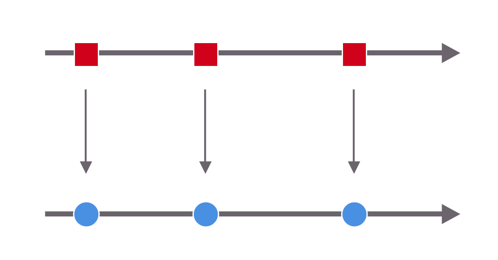

---

# Functional Operators

## Key to understanding Rx
* Transform (select)
* Filter (where)
* Aggregate (max, min, etc)
* Combine (merge, zip)
* Time-based (buffer, window)

---

# Operating on an IObservable
* Operators take IObservable
* Operators return IObservable (sometimes)
* Chain 'em together!
* Operate in turn - one after the other

---

# Transform Diagram

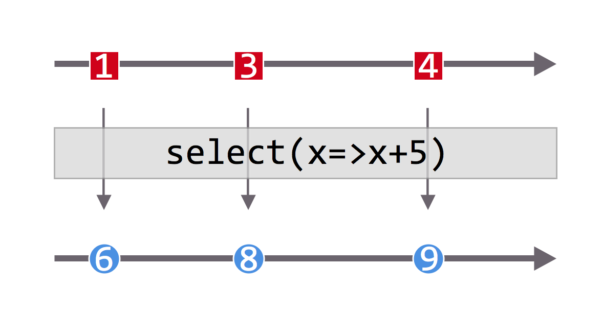

    * Transform an item by applying a function to it
    * aka: select, map, cast

---

# Filtering Diagram

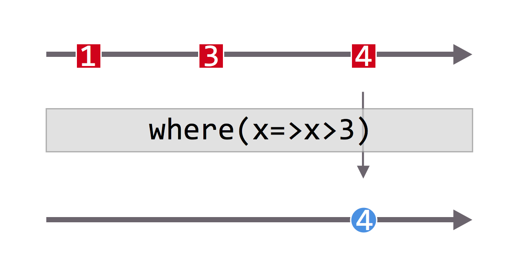

    * Filter the results based on a function
    * Only emit results that pass
    * aka: where, filter

---

# Filtering Diagram

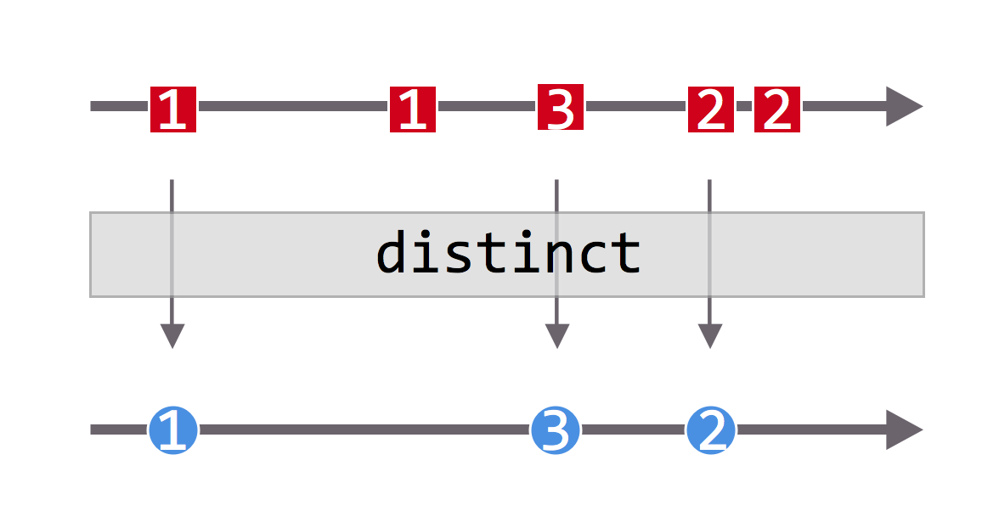

    * Distinct
    * Only emit items which have not been seen already

---

# Filtering Diagram

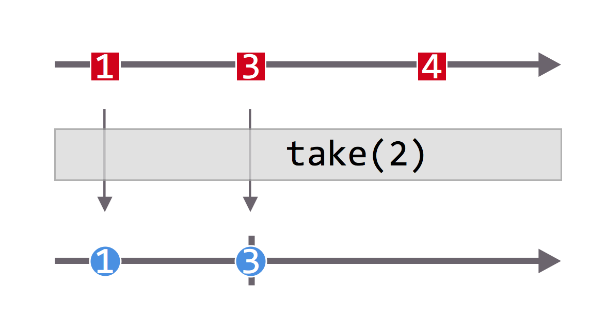

    * Take
    * Emit 'x' amount of items
    * Complete after 'x'

---

# [fit] Demo Time!
<br>
## Move Image Around Screen

---

# [fit] Demo Time!
<br>
## Move Image Around Screen
    * Constrain image to left half of screen
    * Constrain image to top half of screen
    * Make event args easier to deal with

---

# [fit] Demo Time!

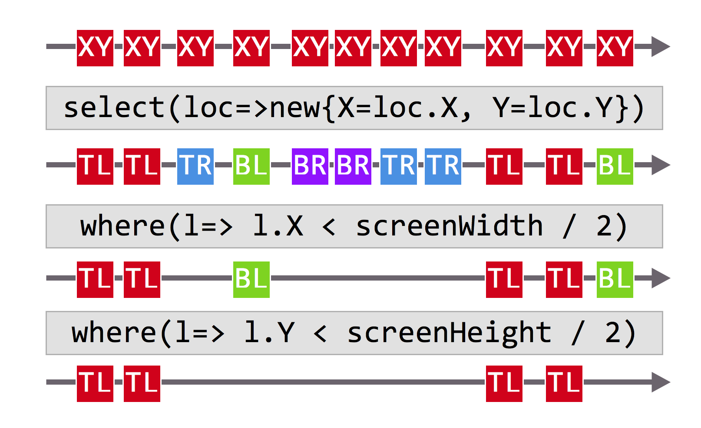

---

# [fit] Demo Time!
<br>
## Handle BLE advertisements

---

# [fit] Demo Time!
<br>
## Handle BLE advertisements
    * Many ads come in
    * Separate by device name
    * Only record distinct readings

---

# [fit] Demo Time!

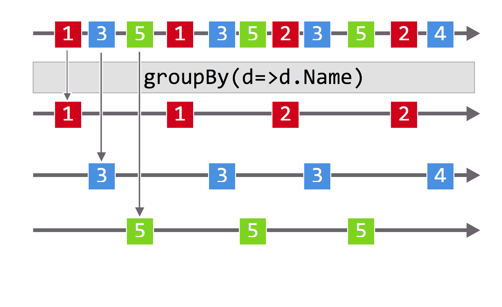

---

# [fit] Demo Time!

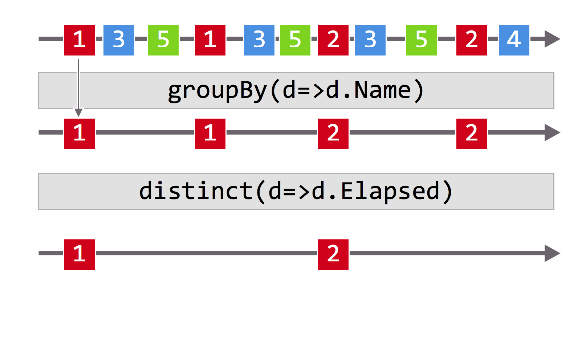

---

# Time Based Operators

* Events through time
* Operators to deal with those
  * Throttle
  * Window
  * Buffer
  * Delay
  * TimeInterval

---

# Time Based Diagram

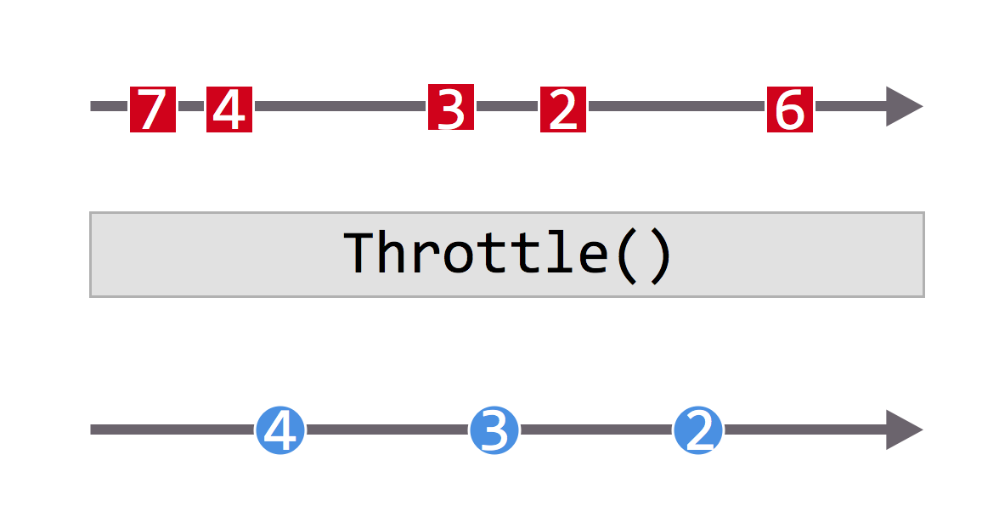

    * aka: throttle, debounce
    * Only emit an observable value if a specified amount of time has passed

---

# Time Based Diagram

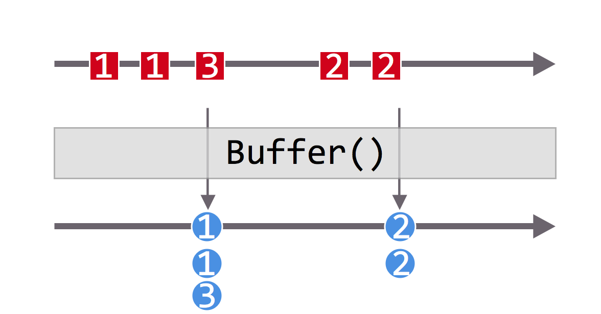

    * Emit a collection of items from an observable from a time span

---

# Time Based Diagram

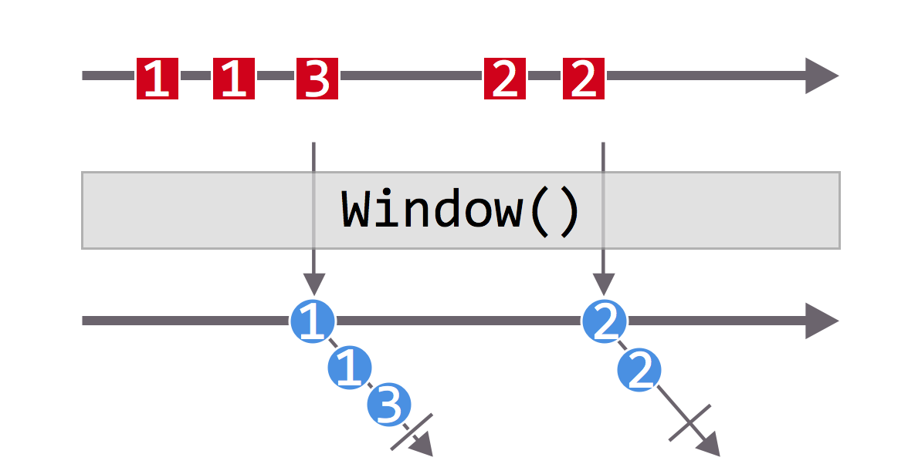

    * Emits observables instead of collections of items in a time span
    * Each observable "packet" is completed

---

# Time Based Diagram

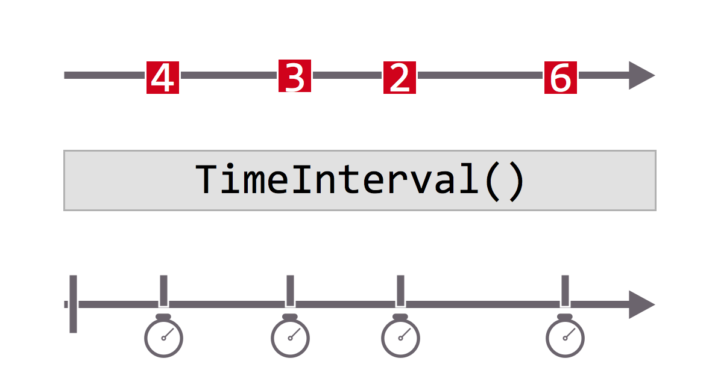

    * Outputs time since last observable emission

---

# When to use Rx
* Anything in UI
* Events
* Network requests
* Callbacks
* Push Async!

---

# Summary
* Rx deals with events
* Turns them into data streams
* Allows familiar manipulation of streams
* Anything IEnumerable<T> can do IObservable<T> can do!
* Think with marble diagrams

---

# Matt Soucoup

* Code Mill Technologies
* Xamarin MVP
* *_Blog:_* **codemilltech.com**
* *_Email:_* **msoucoup@codemilltech.com**
* *_Twitter:_* **@codemillmatt**
